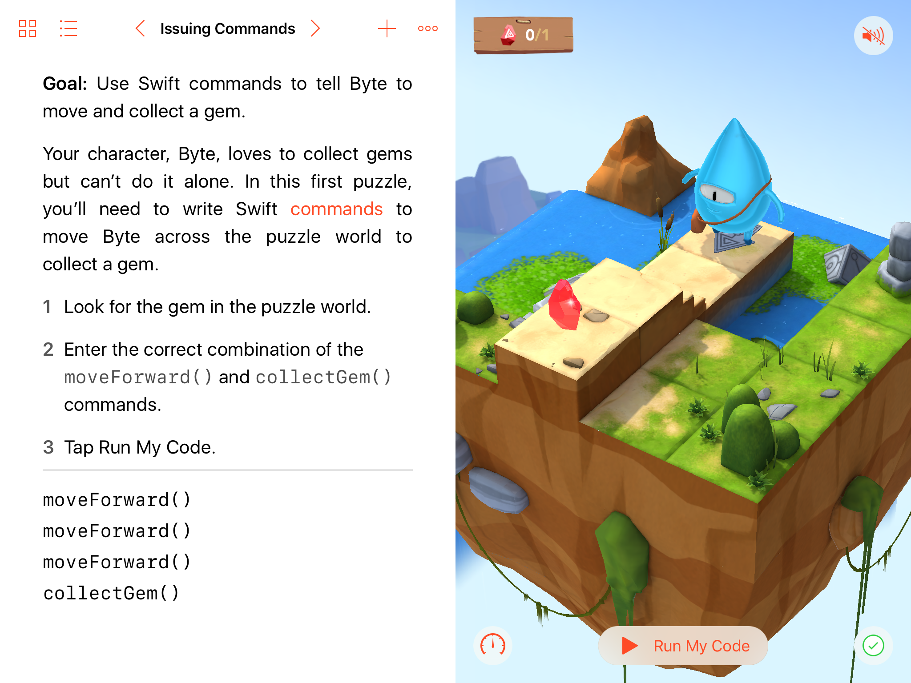

## Swift Playgrounds

#### A kort introduksjon
 
 
@size[0.5em](av)
 
@size[0.5em](Amalie)

Note:
- Dette er en introduksjon til Swift Playgrounds app'en på iPad

---

## Swift

- Swift er programmeringsspråk laget av Apple
- Å programmere er å skrive kode
- Kode er språket som iPaden forstår
- Koden består av instruksjoner som iPaden utfører

---

## Swift Playgrounds

- En iPad app |
- Målet er at man skal lære å skrive kode |
- App'en introduserer ulike konsepter innenfor koding |
- En "playground" (lekeplass) består av ulike oppgaver/brett |
- Målet er å styre figuren "Byte" til å plukke gems (edelstener) og trykke på knapper
- Man skriver kode for å løse brettet |

Note:
- App'en har ulike "puzzles" man må løse ved å skrive swift kode
- Man skriver kode og kan kjøre den med det samme for å se resultatet
- Fokuserer på kode kosepter: kommandoer, funksjoner, parametere, løkker, variabler, operatorer, typer, initialisering (Initialization)

---

## Koderen

@div[left-50]
 
<ul>
<li>Amalie
<li>Jobber med den første playground'en: "Learn to Code 1"
</ul>
@divend

@div[right-50]

@divend

Note:
- Challenge 1 består av 46 brett:
-- Commands (6 brett)
-- Functions (7 brett)
-- For loops (7 brett)
-- Conditional (betingelser) code (7 brett)
-- Logical operators (5 brett)
-- While loops (9 brett)
-- Algorithms (5 brett)

---?image=assets/image/my-playgrounds.png&size=auto 90%

### Playgrounds

Note:
- Det ser ut til å være ca 40 brett/oppgaver på hver playground

---

### Oppgavene

@div[left-40]
 
@ul
- Hver oppgave beskriver hva man må gjøre for løse den
- Skrive kode
- Kjøre/utføre koden
- Får tilbakemelding hvis man gjør noe feil
@ulend
@divend

@div[right-60]

@divend

Note:
- Man får oppgave teksten på venstre halvdel
- Brettet man skal løse vises til høyre
- Får tips om hvilke kommandoer en skal bruke
- Code completion nederst
- Noen ganger litt krøkkete å selecte/highlighte kode/variabler etc

---

### Eksempel videoer

- 1. video viser hvordan app'en forklarer kode konseptet "Funksjoner"
- 2. video viser hvordan man skriver kode for å løse en oppgave

---

Note:
- En video som viser hvordan app'en forklarer kode konsepter

---

Note:
- Amalie live koder en oppgave hvor formålet er å lære å bruke NOT operatoren

---

### Tillegs Playgrounds

#### Det er mange muligheter

- LEGO MINDSTORMS EV3, Sphero SPRK+ & Dash  robots
- Parrot drones (Mambo, Airborne & Rolling Spider)
- Teach a MeeBot to dance
- Skoog musical instrument
- The littleBits Droid Inventor Kit

---?image=assets/image/star-wars-droid.png&opacity=40&position=bottom&size=auto 80%

### littleBits Droid Inventor Kit

- I app'en kan man skrive kode for å styre R2D2
   
   
   
---

---

### Erfaringer

- Det er morsomt! |
- Lett å komme i gang |
- Alt er på engelsk - Litt vanskelig å skjønne alt selv |
- En morsom ting man kan gjøre sammen med mamma/pappa |
