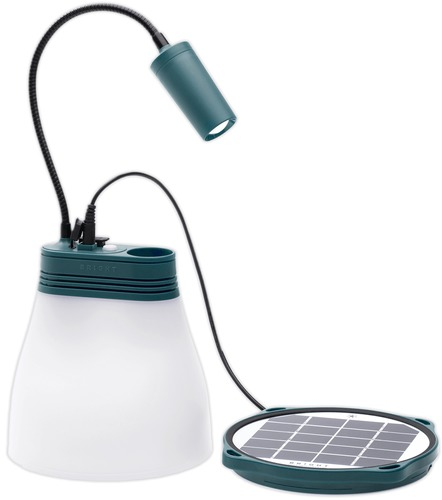

## Swift Playgrounds

#### A short introduction
 
 
@size[0.5em](by)
 
@size[0.5em](Senior Swift developer Amalie & Junior Swift developer Kjartan)

Note:
- Dette er mao en intro til Swift Playgrounds app'en, fra en unges ståsted
- Målet er en kjapp intro til Swift Playgrounds

---

## Swift

- Programming language by Apple
- Adopts the best from C and Objective-C

Note:
- Hørte/leste et sted at en av fordele med Swift var at det ikke var Objective-c :-)
- Swift is statically, strongly typed and uses type inference to determine the initial type of all your variables and constants

---

## Swift Playgrounds

- An iPad app |
- Learning by playing - solving puzzles |
- Instant feedback |
- Introduces and explains the basic coding concepts |

Note:
- App'en har ulike "puzzles" man må løse ved å skrive swift kode
- Man skriver kode og kan kjøre den med det samme for å se resultatet
- Fokuserer på kode kosepter: kommandoer, funksjoner, parametere, løkker, variabler, operatorer, typer, initialisering (Initialization)

---

## The Coder

@div[left-50]
 
<ul>
<li>Amalie (10)
<li>We're at first playground: "Learn to Code 1"
</ul>
@divend

@div[right-50]

@divend

Note:
- Vi har ikke brukt det så mye, mest pga meg
- Challenge 1 består av 46 brett:
-- Commands (6 brett)
-- Functions (7 brett)
-- For loops (7 brett)
-- Conditional (betingelser) code (7 brett)
-- Logical operators (5 brett)
-- While loops (9 brett)
-- Algorithms (5 brett)

---?image=assets/image/my-playgrounds.png&size=auto 90%

### Playgrounds

Note:
- Det ser ut til å være ca 40 brett/oppgaver på hver playground

---

### The puzzles

@div[left-40]
 
@ul
- The goal of the puzzle
- Write code
- Run it (or debug)
@ulend
@divend

@div[right-60]

@divend

Note:
- Man får oppgave teksten på venstre halvdel
- Brettet man skal løse vises til høyre
- Får tips om hvilke kommandoer en skal bruke
- Code completion nederst
- Noen ganger litt krøkkete å selecte/highlighte kode/variabler etc

---

### Examples

- I have recorded some "screencasts" to show some of the features
- Amalie will do some "live" coding

---

Note:
- En screencast som viser hvordan app'en forklarer kode konsepter

---

Note:
- Amalie live koder en puzzle hvor formålet er å lære å bruke NOT operatoren

---

### Accessory Playgrounds

#### More than just solving puzzles..

- LEGO MINDSTORMS EV3, Sphero SPRK+ & Dash  robots
- Parrot drones (Mambo, Airborne & Rolling Spider)
- Teach a MeeBot to dance
- Skoog musical instrument
- The littleBits Droid Inventor Kit

---?image=assets/image/star-wars-droid.png&opacity=40&position=bottom&size=auto 80%

### The littleBits Droid Inventor Kit

- Comes with a playground to write your own code for the droid
   
   
   
---

---

### Lessons learned

- It's fun! |
- Easy to get started |
- English may be a barrier |
- Keep it simple (don't get carried away) |
- It "competes" with Netflix, Youtube, games etc |
- Make it a thing you do togheter with your kid(s) |

Note:
- Vi har som nevnt ikke brukt det så mye (ref språk barriere)
- Alt er foreløpig på engelsk, det gjør det vanskelig å drive på egenhånd
- Ikke alltid like populært at jeg forsøker å få henne til å lese og forstå oppgaven selv (på engelsk)
- Puzzle/spill konseptet er genialt
- Refaktorering hæ?! "Det funker pappa, hvorfor skal vi endre på det da?"
- Store spørsmål som hva er poenget, hvorfor lære koding, er det gøy?
- Som med alt annet så er det alltid noe mer "spennende" å gjøre på ipad'en.. Det er en grunn til at vi fremdeles er på "Learn to code 1"
- Ikke forvent at ungen blir helt hekta. Gjør det heller til noe dere gjør sammen

---

---

### Next topic

---

### Sabona

- Bistandsorganisasjon
- Vi besøkte Zimbabwe julen 2015
- Privat innsamlingsaksjon

Note:
- Vi samlet inn penger til matutdeling når vi var der i 2015
- Nå har vi bestemt oss for å samle inn penger til solcelle drevede lamper

---

### BRIGHT SunBell

#### Solcelle drevet lampe

@div[left-50]
 
<ul>Lampe
<li>Lommelykt
<li>Lader
</ul>
@divend

@div[right-50]

@divend

---

### God tur!!
